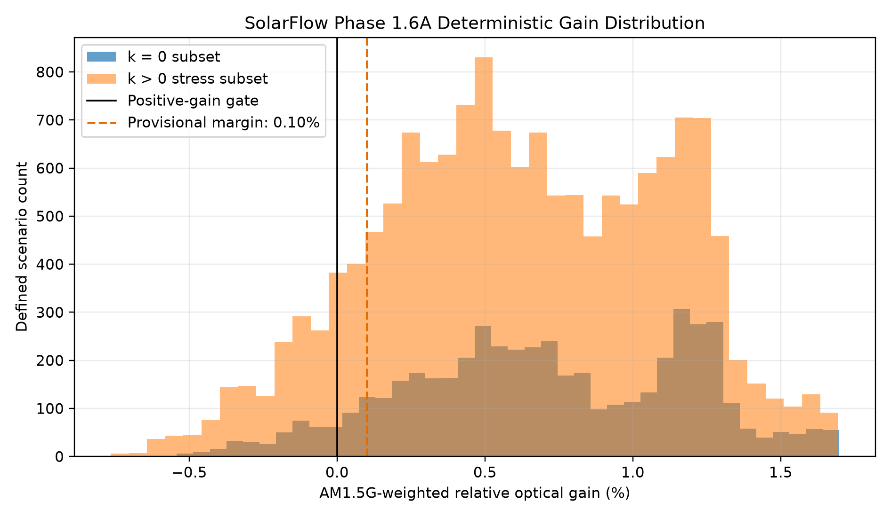
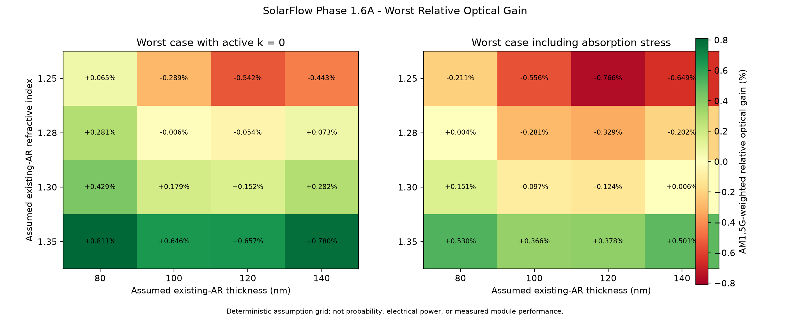
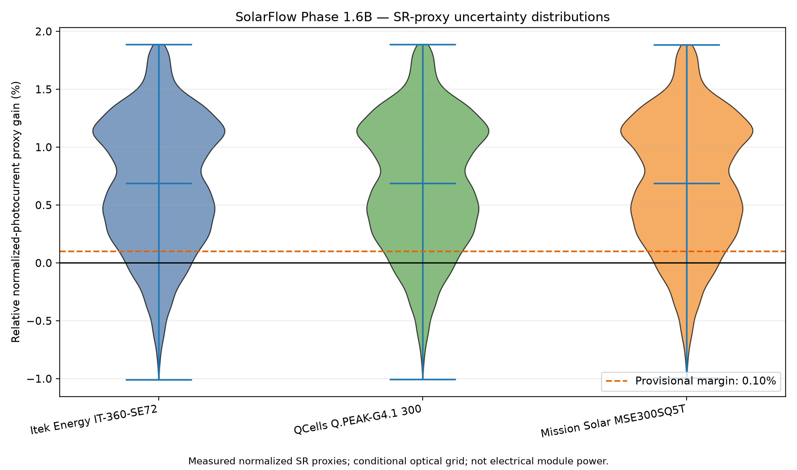
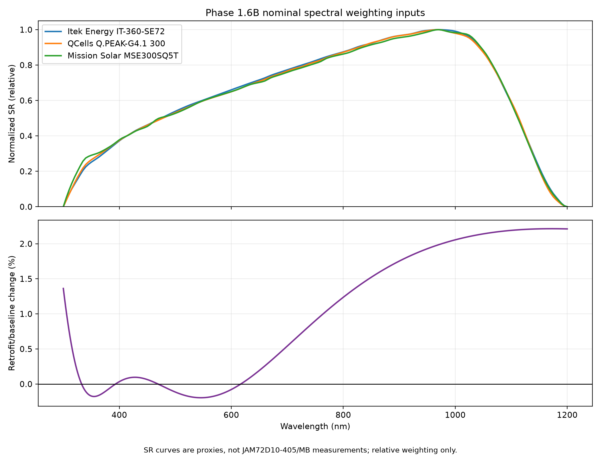

# SolarFlow AI — Phase 1.6 Research Record
## Conditional optical uncertainty and measured-SR proxy weighting

| Record field | Value |
|---|---|
| Research date | 2 September 2026 |
| Reference module | JA Solar JAM72D10-405/MB (390–410/MB family) |
| Depends on | `docs/SolarFlow_Phase_1_5_Research_Record.md` |
| Scientific status | Conditional numerical evidence; not actual-module validation |

---

## 1. Executive decision

Phase 1.6 is complete within its defined numerical and public-data boundary.

The phase establishes two results:

1. **Phase 1.6A:** the modeled optical benefit is sensitive to the assumed
   factory AR layer and candidate optical properties. Most, but not all, of the
   deterministic assumption grid remains positive.
2. **Phase 1.6B:** reweighting the modeled retrofit spectrum with normalized
   median spectral-response curves measured on three commercial mono-Si PERC
   reference modules produces a tightly grouped nominal relative
   photocurrent-proxy gain of approximately `+0.814%`.

The result is encouraging but conditional. The grid still contains negative
cases, and none of the proxy SR curves is a measurement of the target
JAM72D10-405/MB module.

Therefore:

```text
CONDITIONAL OPTICAL EVIDENCE       = COMPLETE
MEASURED-SR PROXY ENSEMBLE         = COMPLETE
ACTUAL TARGET-MODULE EQE/SR        = OPEN
ACTUAL TARGET OPTICAL STACK        = OPEN
VALIDATED ELECTRICAL POWER GAIN    = OPEN
ANNUAL/FIELD ENERGY GAIN           = OPEN
```

The project may report the Phase 1.6 results using the approved language in
this record. It must not convert the `+0.814%` proxy result into a measured or
validated module-power claim.

---

## 2. Research boundary inherited from Phase 1.5

Phase 1.5 established documentary evidence for the target module family and
for the physical plausibility of porous/hollow-silica material classes near
the optimized effective refractive index. It did not locate sufficiently
authoritative public data for:

- exact JAM72D10-405/MB EQE or spectral responsivity;
- exact factory AR chemistry, thickness, `n(lambda)`, or `k(lambda)`;
- measured candidate-film `n(lambda)` and `k(lambda)`;
- target-module baseline and retrofit I–V curves.

Phase 1.6 does not fill those gaps with invented measurements. It asks two
narrower questions:

> How sensitive is the modeled optical result to a declared grid of uncertain
> optical assumptions?

and

> Does the conclusion materially change when the retrofit spectrum is weighted
> by multiple measured commercial-module SR shapes rather than by optical power
> alone?

---

## 3. Source-of-truth conditional stack

The Phase 1.6 nominal engineering checkpoint is:

```text
Air
-> active optical layer: n = 1.092934, k = 0, d = 116.736 nm
-> release primer: n = 1.20, d = 50 nm
-> assumed existing AR: n = 1.28, d = 100 nm
-> representative cover glass: n = 1.52
```

The corresponding baseline is:

```text
Air
-> assumed existing AR: n = 1.28, d = 100 nm
-> representative cover glass: n = 1.52
```

The active layer and primer are modeled design parameters, not a selected
commercial material or fabrication recipe. The existing AR and glass values
are representative assumptions, not measured properties of the installed
Sirindhorn modules.

---

## 4. Phase 1.6A — deterministic optical assumption sensitivity

### 4.1 Method

Phase 1.6A evaluates a deterministic grid from 300 to 1200 nm using a coherent
normal-incidence thin-film transfer-matrix model and Solcore's standard AM1.5G
spectral power density.

For each assumed existing-AR pair, the baseline and retrofit use the same AR
parameters. The primary metric is:

```text
relative optical gain (%)
  = 100 * (retrofit transmitted optical power
           - baseline transmitted optical power)
          / baseline transmitted optical power
```

The defined grid varies:

| Parameter | Defined values |
|---|---|
| Existing AR index | 1.25, 1.28, 1.30, 1.35 |
| Existing AR thickness | 80, 100, 120, 140 nm |
| Active-layer index | 1.08, 1.09, 1.092934, 1.10, 1.12, 1.14, 1.15 |
| Active-layer extinction coefficient | 0, 1e-5, 1e-4, 1e-3 |
| Active-layer thickness | 100, 110, 116.736, 125, 135 nm |
| Primer index | 1.15, 1.20, 1.25 |
| Primer thickness | 30, 50, 75 nm |

This produces `20,160` deterministic optical cases. Grid fractions are not
probabilities or confidence intervals.

### 4.2 Results

| Metric | Phase 1.6A result |
|---|---:|
| Nominal relative optical gain | `+0.6667%` |
| Overall minimum gain | `-0.7657%` |
| Overall median gain | `+0.6315%` |
| Positive cases | `18,234 / 20,160 (90.45%)` |
| Cases passing provisional `+0.10%` margin | `17,430 / 20,160 (86.46%)` |
| Minimum gain in lossless subset (`k = 0`) | `-0.5421%` |

The largest main-effect spreads were:

| Rank | Assumed parameter | Main-effect spread |
|---:|---|---:|
| 1 | Existing AR refractive index | `1.0224` percentage points |
| 2 | Existing AR thickness | `0.5770` percentage points |
| 3 | Active-layer extinction coefficient | `0.2412` percentage points |

### 4.3 Phase 1.6A interpretation

The nominal optical point is positive, and most defined scenarios remain
positive. However, the grid contains negative cases even in the lossless
subset. The architecture is therefore **conditionally positive**, not robust
throughout the complete declared uncertainty envelope.

The sensitivity ranking shows that measuring the real factory AR optical
properties has higher decision value than further refinement of the nominal
optimizer point alone.





---

## 5. Phase 1.6B — measured commercial-module SR proxy ensemble

### 5.1 Data source and provenance

Phase 1.6B uses the processed DuraMAT/Sandia module spectral-response library:

- Current DuraMAT dataset page:
  <https://datahub-duramat.nlr.gov/data-repo/dataset/module-sr-library>
- Legacy DuraMAT record:
  <https://datahub.duramat.org/dataset/module-sr-library>
- OSTI record: <https://www.osti.gov/biblio/2204677>
- DOI: `10.21948/2204677`
- Processing report: SAND2023-02045,
  <https://www.osti.gov/servlets/purl/2293575>

The source record describes NREL module quantum-efficiency measurements on
stored commercial modules. The Sandia processing method uses median response,
converts median QE to spectral response, normalizes the curves, adds zero
endpoints at 300 and 1200 nm, and interpolates the processed response.

The local dataset used for this run was recorded as:

```text
File: data/external/sr_library.nc
Format: HDF5 / NetCDF group dataset
Size observed before execution: approximately 328 KiB
SHA-256: baf93fdacadd5d829dd0d2b526673b60c9185807851f8810bc7b6f1f08d68b47
```

The data file is not committed to the repository. The DuraMAT resource page
displayed `No License Provided` at the time of the study, so the project keeps
only its URL, processing description, and run-specific digest until reuse
terms are clarified.

### 5.2 Reference-module ensemble

Three measured mono-Si PERC module groups are used together:

| Proxy | NetCDF group | Role and limitation |
|---|---|---|
| Itek Energy IT-360-SE72 | `Itek_360_mono` | architecture-nearest proposed reference; not a bifacial double-glass target module |
| QCells Q.PEAK-G4.1 300 | `Qcells_300_mono` | independent measured manufacturer/construction reference |
| Mission Solar MSE300SQ5T | `Mission_300_mono` | independent measured manufacturer/construction reference |

No proxy is labeled as equivalent to JAM72D10-405/MB. Results are reported for
all three curves and as an across-proxy ensemble; the most favorable proxy is
never selected alone.

### 5.3 Calculation

For every Phase 1.6A optical case and every SR proxy, Phase 1.6B calculates:

$$
g_{SR}=100\left[
\frac{\int E_{AM1.5G}(\lambda)SR_p(\lambda)
\frac{T_{retro}(\lambda)}{T_{base}(\lambda)}d\lambda}
{\int E_{AM1.5G}(\lambda)SR_p(\lambda)d\lambda}-1\right].
$$

The ratio `T_retro/T_base` applies only the modeled front-surface spectral
change to each measured proxy response. This avoids applying the simplified
baseline optical stack a second time to a response curve that already embeds
the proxy module's own construction.

The reported quantity is:

> **relative normalized-photocurrent proxy gain**

Because the SR curves are normalized, the result is relative and
scale-invariant. It cannot establish absolute A/W, Isc, Imp, Pmax, efficiency,
or annual energy.

### 5.4 Results

The program evaluated:

```text
20,160 optical cases × 3 measured SR proxies = 60,480 combinations
```

Nominal results:

| SR proxy | Nominal relative photocurrent-proxy gain |
|---|---:|
| Itek `Itek_360_mono` | `+0.8139%` |
| QCells `Qcells_300_mono` | `+0.8152%` |
| Mission Solar `Mission_300_mono` | `+0.8144%` |
| Across-proxy minimum / median / maximum | `+0.8139% / +0.8144% / +0.8152%` |

Conservative across-proxy grid results:

| Metric | Phase 1.6B result |
|---|---:|
| Cases positive for every proxy | `17,719 / 20,160 (87.89%)` |
| Cases passing `+0.10%` for every proxy | `16,948 / 20,160 (84.07%)` |
| Worst across-proxy case | `-1.0089%` |

The nominal spread among the three proxies is only about `0.0013` percentage
points. Within this selected ensemble, proxy choice has little influence on
the nominal result. The larger risk remains the uncertain physical optical
stack and candidate properties identified in Phase 1.6A.





---

## 6. Combined interpretation

Phase 1.6A and Phase 1.6B answer different questions:

| Question | Answer |
|---|---|
| Is the nominal simplified optical stack beneficial under AM1.5G optical-power weighting? | Yes, approximately `+0.6667%` relative transmitted optical power. |
| Is the nominal result sensitive to which of the three measured mono-Si PERC SR proxies is used? | Very little; nominal proxy results span `+0.8139%` to `+0.8152%`. |
| Is the modeled architecture positive throughout the complete declared assumption grid? | No. Both phases contain negative worst cases. |
| Does Phase 1.6 establish electrical module power gain? | No. It has no target-module EQE/SR calibration or measured baseline/retrofit I–V pair. |
| Does Phase 1.6 validate a physical material or fabrication process? | No. Candidate-specific spectral constants, wet-state behavior, haze, adhesion, and durability remain unmeasured. |

The proxy-weighted nominal value is higher than the optical-power-only nominal
value because measured silicon SR shapes place different relative weight on
wavelengths where the modeled transmission modifier is favorable. This is a
spectral-weighting effect, not evidence of extra energy creation and not a
conversion efficiency measurement.

---

## 7. Evidence status matrix after Phase 1.6

| Evidence item | Status | Defensible conclusion |
|---|---|---|
| Target module identity and datasheet anchors | CLOSED — documentary | JA Solar family and electrical nameplate data are documented |
| Bifacial double-glass construction | CLOSED — documentary | Family-level construction is documented |
| Actual target-module factory AR stack | OPEN | Requires direct documentation or measurement |
| Low-index material class near `n ≈ 1.09` | CLOSED — literature precedent | Fabricated porous/hollow-silica classes exist |
| Exact SolarFlow candidate `n(lambda)`, `k(lambda)` | OPEN | Requires candidate-specific characterization |
| Phase 1.6A deterministic optical grid | COMPLETE — simulation | Most but not all declared cases are positive |
| Commercial mono-Si PERC normalized SR proxies | CLOSED — external measured proxy data | Suitable for comparative sensitivity, not target equivalence |
| Phase 1.6B SR-proxy ensemble | COMPLETE — proxy-weighted simulation | Nominal result is insensitive to the three selected proxy shapes |
| Actual JAM72D10-405/MB EQE/SR | OPEN | No target-specific measurement is available |
| Absolute target photocurrent gain | OPEN | Normalized proxies cannot provide absolute current |
| Target-module Pmax gain | OPEN | Requires calibrated target EQE/SR and measured I–V |
| Annual energy gain | OPEN | Requires angle, temperature, weather, bifacial, and system modeling after calibration |
| Durability and field suitability | OPEN | Requires wet-state, haze, adhesion, abrasion, thermal, and aging tests |

---

## 8. Approved and prohibited claim language

### Approved technical statement

> Under the conditional Phase 1.6A optical-stack assumptions, the SolarFlow
> retrofit produced a nominal AM1.5G-weighted relative optical-transmission gain
> of approximately 0.667%. Reweighting the modeled spectral modifier with
> normalized median spectral-response measurements from three commercial
> mono-Si PERC reference modules produced nominal relative photocurrent-proxy
> gains of approximately 0.814%, with very small variation among the selected
> proxies. The deterministic uncertainty grid includes negative cases, and the
> proxy curves are not measurements of JAM72D10-405/MB; therefore these results
> are conditional numerical evidence, not validated electrical-power or field-
> energy gains.

### Approved short statement

> SolarFlow retains a positive nominal modeled benefit under three independent
> measured mono-Si PERC spectral-response proxies, but the result remains
> conditional on unverified target-module optical assumptions.

### Prohibited statements

Do not state:

- “SolarFlow increases JAM72D10-405/MB electrical power by 0.814%.”
- “The Sirindhorn floating-solar plant will produce 0.814% more energy.”
- “The three proxy modules prove the target module response.”
- “87.89% is the probability that the retrofit works.”
- “The optimized index and thickness are a completed material specification.”
- “The model validates durability, safety, warranty compatibility, or field
  performance.”

---

## 9. Reproducibility record

Required environment:

```bash
conda activate solarflow-full
python -m pip install xarray h5netcdf
```

Phase 1.6A:

```bash
python -m product1.analysis.phase_1_6_optical_sensitivity --self-test
python -m product1.analysis.phase_1_6_optical_sensitivity
```

Phase 1.6B:

```bash
python -m product1.analysis.phase_1_6b_proxy_sr --self-test
python -m product1.analysis.phase_1_6b_proxy_sr
```

Configuration and method files:

```text
configs/phase_1_6_sensitivity.yaml
configs/phase_1_6b_proxy_sr.yaml
docs/phase_1_6_assumption_register.md
docs/phase_1_6b_proxy_sr_method.md
```

Primary result files:

```text
product1/results/phase_1_6_optical_sensitivity.csv
product1/results/phase_1_6_optical_sensitivity_summary.json
product1/results/phase_1_6b_proxy_sr.csv
product1/results/phase_1_6b_proxy_sr_summary.json
```

External input:

```text
data/external/sr_library.nc
```

The external NetCDF file remains ignored by Git. Reproduction requires an
independently obtained copy whose digest matches the value recorded in this
document and the Phase 1.6B summary JSON.

---

## 10. Next research gates

The highest-value next actions are evidence acquisition rather than additional
unconstrained optimization.

### Gate A — actual target optical stack

Obtain or measure:

- front reflectance and transmittance versus wavelength;
- factory AR thickness and optical constants;
- cover-glass dispersion and surface structure;
- haze and total/diffuse transmission where possible.

### Gate B — actual target electrical response

Obtain or measure:

- target-module EQE or spectral responsivity;
- calibrated baseline I–V at controlled irradiance and temperature;
- matched retrofit I–V using the same module and conditions.

### Gate C — candidate material characterization

Measure:

- `n(lambda)` and `k(lambda)`;
- thickness and thickness uniformity;
- wet-state and humidity-dependent optical response;
- haze, roughness, adhesion, abrasion resistance, removability, and aging.

### Gate D — field/annual-yield interpretation

Only after Gates A–C should the project add:

- incidence-angle distribution;
- module temperature and thermal penalties;
- bifacial rear-side contribution;
- soiling, humidity, rainfall, wind, degradation, and system losses;
- annual weather-driven energy simulation.

---

## 11. Final Phase 1.6 decision

Phase 1.6 materially improves the research record without crossing the
measurement boundary.

It demonstrates that:

1. the nominal modeled retrofit remains favorable under optical-power and
   measured-SR-proxy weighting;
2. the three selected commercial SR proxies produce nearly identical nominal
   relative results;
3. uncertainty in the physical target optical stack is more important than
   proxy selection;
4. negative regions remain inside the declared assumption envelope.

The correct project status is:

```text
ADVANCE AS A CONDITIONAL RESEARCH CANDIDATE.
DO NOT FREEZE A PHYSICAL MATERIAL SPECIFICATION.
DO NOT CLAIM VALIDATED ELECTRICAL OR FIELD-ENERGY GAIN.
PRIORITIZE TARGET-STACK, TARGET-EQE/SR, I-V, AND MATERIAL MEASUREMENTS.
```

Phase 1.6 is therefore a successful numerical-risk-reduction phase, not a
finished product-validation phase.
