# SolarFlow Retrofit Optical Skin — Concept v0

**Project:** SolarFlow AI  
**Reference module:** JA Solar JAM72D10-405/MB double-glass module  
**Application context:** Sirindhorn floating solar  
**Status:** Engineering concept for simulation and team review — not a fabrication specification

## 1. Design decision

The recommended first product concept is a **replaceable, edge-retained optical skin** installed above the existing solar-module cover glass.

The current optimized values (`n = 1.100474`, `thickness = 118.791 nm`) describe only the **active optical coating** in the assumed simulation. They do not describe a free-standing sheet. A real product also needs a carrier, an interface to the existing glass, edge retention, sealing and environmental protection. Every added optical layer must be included in the next simulation before a performance claim is made.

```mermaid
flowchart TB
    A["Air / outdoor environment"] --> B["Optional protective or anti-soiling surface"]
    B --> C["Nanoporous low-index active coating — current target about 119 nm"]
    C --> D["Transparent carrier film — material and thickness TBD"]
    D --> E["Removable optical interface — dry contact, coupling layer or controlled gap"]
    E --> F["Existing module AR coating — exact stack still unknown"]
    F --> G["Existing 2 mm front glass"]
    G --> H["Encapsulant and solar cell"]
```

## 2. Why this architecture fits the Circular track

- It does not require replacing the existing PV module.
- It avoids drilling or permanently modifying the module frame and glass.
- The optical skin can be removed for inspection, recoating, repair or recycling.
- The active coating and carrier can be replaced without discarding the solar panel.
- Mechanical edge retention supports a take-back and refurbishment model.
- The design can carry a material passport or QR code for batch, coating and service history.

## 3. Candidate product architecture

| Component | Concept-v0 role | Current status | Main design question |
| --- | --- | --- | --- |
| Active low-index coating | Reduce reflection through thin-film interference | Numerically optimized only for the assumed baseline | Can `n≈1.10` and about `119 nm` be manufactured with adequate durability? |
| Transparent carrier | Supports the nanometre-scale coating | Not simulated | Which carrier gives high transmission, low haze, UV stability and recyclability? |
| Optical interface | Controls the gap between carrier and existing glass | Not simulated | Dry contact, reversible optical coupling layer, or a deliberately controlled air gap? |
| Edge seal | Prevents water and dirt entering the interface | Not designed | How can the seal drain safely and remain removable? |
| Retention clips/frame | Holds the skin without drilling the module | Not designed | Can it use the existing aluminium frame without shading active cells? |
| Protective top surface | Resists cleaning, abrasion, UV and soiling | Optional; not simulated | Does an added protective layer cancel the optical gain? |

## 4. Three physical concepts considered

### A. Edge-retained flexible optical skin — recommended concept

The low-index coating is deposited on a thin transparent carrier. The carrier is tensioned above or optically coupled to the module and retained only at the perimeter.

**Advantages**

- Reversible and replaceable.
- Strong Circular-economy narrative.
- Low added mass compared with a second glass plate.
- Can potentially be installed without disconnecting or replacing the module.

**Risks**

- Carrier and interface change the optical stack and may remove the modeled gain.
- Wrinkles, trapped water, air bubbles and dirt can create scattering or hot spots.
- Wind flutter and thermal expansion must be controlled.
- The coating may require a protective surface that also changes the optics.

### B. Direct removable nanoporous coating

A low-index sol-gel or nanoporous coating is applied directly onto the existing cover glass and later stripped or renewed.

**Advantages**

- Closest geometry to the current simplified simulation.
- No carrier-film optical penalty.

**Risks**

- Removal without damaging the manufacturer's coating is unproven.
- May affect module warranty and cleaning procedures.
- Field coating uniformity at approximately 119 nm is difficult without controlled equipment.
- Lower-index porous coatings can trade optical performance for reduced hardness and wear resistance.

### C. Removable rigid optical cover plate

A thin coated glass or transparent rigid plate is attached above the existing module using frame clips.

**Advantages**

- Mechanically stable and easy to handle as a replaceable part.
- Coating can be produced under controlled factory conditions.

**Risks**

- Added weight and wind loading on a floating system.
- Extra reflective interfaces and possible water trapping.
- Higher material use and transport impact.

## 5. Concept-v0 installation arrangement

1. Use the existing module frame as the only mechanical attachment boundary.
2. Do not drill the frame, glass or floating structure.
3. Keep clips, seals and tensioning elements outside the active cell area.
4. Include drainage paths at the lowest edge of the tilted module.
5. Make the optical skin removable using standard hand tools.
6. Give each skin a batch identifier for material, coating and maintenance tracking.
7. Inspect compatibility with module grounding, cables, junction box access and cleaning equipment.

## 6. What the current simulation does and does not validate

### Numerically validated

- Assumed stack: air → retrofit layer → existing AR → glass.
- Existing AR assumption: `n = 1.28`, thickness `100 nm`.
- Candidate: `n = 1.100474`, thickness `118.791 nm`.
- AM1.5G-weighted, normal-incidence relative optical gain at resolution 300: `+0.717090%`.
- Meep/TMM agreement and resolution convergence at 200, 250 and 300 pixels/µm.

### Not yet validated

- Any carrier film.
- Adhesive, gel, air gap or dry-contact interface.
- Protective or anti-soiling topcoat.
- Real JA Solar AR-stack composition and optical constants.
- Oblique sunlight, TE/TM polarization or annual angle distribution.
- Water film, condensation, dirt, biofouling, UV aging and cleaning abrasion.
- Electrical power, annual energy yield, installation cost and payback.

## 7. Next simulation gate

Use TMM for rapid screening before another high-resolution Meep run.

### Stage 1 — carrier/interface screen with TMM

| Variable | Initial exploratory values | Reason |
| --- | --- | --- |
| Carrier refractive index | 1.35, 1.40, 1.50, 1.60 | Tests low- to high-index transparent carriers without claiming a material yet |
| Carrier thickness | 25, 50, 100, 200 µm | Captures realistic film-scale optical thickness |
| Interface | optical contact, controlled air gap, reversible coupling layer | Determines whether additional reflections dominate |
| Retrofit index | 1.05–1.30 | Covers low-index porous-coating candidates |
| Retrofit thickness | 50–250 nm | Re-optimizes around the current 119 nm candidate |
| Existing AR baseline | retain the approved sensitivity grid | Tests robustness to the unknown installed coating |

### Stage 2 — spectrum and angle robustness

- Wavelength: 300–1200 nm with AM1.5G weighting.
- Incidence angle: 0°, 15°, 30°, 45° and 60°.
- Polarization: TE and TM, plus their unpolarized average.
- Add water-interface cases only after the dry-stack model is stable.

### Stage 3 — independent validation

1. Rank candidates using TMM and reject designs that only work at one wavelength.
2. Validate the best few complete stacks with Meep.
3. Confirm Meep/TMM agreement and resolution convergence.
4. Pass the validated transmitted spectrum to Solcore for electrical modeling.

> A 50–200 µm carrier should not be inserted directly into the current resolution-300 Meep workflow before TMM screening; its physical thickness would greatly increase the computational domain. TMM should eliminate weak concepts first.

## 8. Provisional acceptance criteria for concept selection

These are design gates for team discussion, not verified product specifications.

- Optical improvement remains positive across the selected AM1.5G spectrum and practical angles.
- The design does not depend on one exact unknown existing-AR thickness.
- No permanent adhesive or drilling is required on the module.
- Added components do not shade active cells or obstruct drainage and maintenance.
- The optical skin is separable, replaceable and traceable at end of service.
- Material and installation assumptions are documented and reproducible.
- Durability risks are explicitly tested before any field-performance claim.

## 9. Evidence and literature notes

- NREL/OSTI reports that increasing porosity can improve coating optical performance while reducing coating hardness and wear resistance: [Nondestructive Characterization of Antireflective Coatings](https://www.osti.gov/servlets/purl/1774855).
- A reported silica moth-eye film shows broadband and wide-angle antireflective behavior with improved abrasion resistance relative to a nanoparticle control, supporting structured protective approaches rather than an unprotected porous layer: [Scientific Reports 8, 2018](https://www.nature.com/articles/s41598-018-19414-x).
- Mechanically robust nanoporous inorganic coatings remain an active research direction rather than a confirmed drop-in field retrofit: [OSTI — Porous but Mechanically Robust All-Inorganic Antireflective Coatings](https://www.osti.gov/servlets/purl/1969403).
- The exact JA Solar module revision and installed optical stack remain required before converting this concept into a fabrication specification.

## 10. Current recommendation

Carry **Concept A: edge-retained flexible optical skin** forward as the Circular product architecture, but do not lock the carrier material yet. The next technical task is to extend the TMM model to include the carrier and interface, then determine whether a practical removable construction can retain a positive broadband gain.