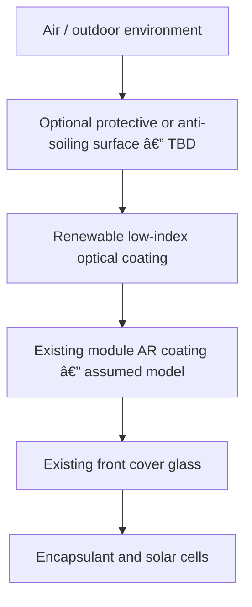

# SolarFlow Renewable Optical Coating — Concept v1

**Project:** SolarFlow AI  
**Competition track:** Circular Innovation  
**Reference module:** JA Solar JAM72D10-405/MB double-glass module  
**Application context:** Sirindhorn floating solar  
**Status:** Simulation-led engineering concept — not a fabrication specification or field-performance claim

## 1. Executive decision

The recommended product direction is now a **service-renewable optical coating applied directly above the existing module coating**, rather than a conventional transparent carrier film.

The original edge-retained carrier concept was screened because it offered strong removability and circularity. However, the complete-stack simulation showed that ordinary carrier-index assumptions reverse the predicted optical benefit. Re-optimization found only a very narrow positive region requiring an effective carrier refractive index below approximately `1.282`, with almost no remaining performance margin.

The carrier architecture is therefore retained only as a **long-term research option for an ultra-low-index carrier**. It is not the primary competition concept.



## 2. Why the design changed

### 2.1 Validated simplified optical result

The previously validated model represented:

```text
Air
→ Retrofit optical coating
→ Existing anti-reflection coating
→ Solar-panel cover glass
```

Under the current assumptions, the selected coating was:

- Refractive index: `n = 1.100474`
- Thickness: `118.791 nm`
- Wavelength range: `300–1200 nm`
- Spectrum: AM1.5G
- Incidence: normal

At Meep resolution `300 pixels/µm`, the model produced:

| Quantity | Result |
| --- | ---: |
| Incident optical power in modeled band | `836.0815 W/m²` |
| Existing-AR transmitted optical power | `827.4503 W/m²` |
| Retrofit-stack transmitted optical power | `833.3811 W/m²` |
| Additional transmitted optical power | `+5.9336 W/m²` |
| Meep relative optical gain | `+0.717090%` |
| TMM relative optical gain | `+0.717433%` |
| Meep–TMM gain difference | `0.000343%` |

The Meep result passed the individual validation criteria at resolutions `200`, `250` and `300 pixels/µm`. The two highest-resolution results also passed the convergence gate.

### 2.2 Carrier/interface screen

The first physical-product screen inserted generic carriers and interfaces while retaining the original coating.

Variables included:

- Carrier refractive indices: `1.35`, `1.40`, `1.50`, `1.60`
- Carrier thicknesses: `25`, `50`, `100`, `200 µm`
- Interfaces: optical contact, controlled air gap and reversible coupling layer
- Total candidates: `48`

Result:

| Quantity | Result |
| --- | ---: |
| Positive-gain physical candidates | `0 / 48` |
| Best interface | Optical contact |
| Best generic carrier index | `1.35` |
| Best screened carrier thickness | `50 µm` |
| Best transmitted optical power | `821.488 W/m²` |
| Additional power versus baseline | `−5.957 W/m²` |
| Relative optical change | `−0.7199%` |

The added carrier did not merely reduce the original gain; it changed the sign of the result.

### 2.3 Complete-stack re-optimization

The coating refractive index and thickness were then re-optimized for an optical-contact carrier stack. The carrier index was scanned from `1.20` to `1.40`.

| Quantity | Result |
| --- | ---: |
| Highest sampled carrier index with positive gain | `1.28` |
| Optimized coating index at that point | `1.13089` |
| Optimized coating thickness at that point | `127.64 nm` |
| Relative optical gain at that point | `+0.0108%` |
| Approximate added transmitted optical power | `+0.089 W/m²` |
| Interpolated zero-gain carrier index | `1.2818` |

This result is a feasibility boundary, not a material selection. The predicted positive margin at `n = 1.28` is too small to absorb realistic penalties from material absorption, haze, surface roughness, thickness variation, contamination, water or aging.

## 3. Concept-v1 product architecture

The proposed system is a **maintenance-delivered optical surface renewal service** rather than a permanent second panel cover.

### 3.1 Functional layers

| Component | Function | Current evidence | Required validation |
| --- | --- | --- | --- |
| Renewable optical coating | Reduce reflection through a low-index optical layer | Positive simulated broadband gain for the assumed simplified stack | Real material dispersion, absorption, porosity, uniformity and adhesion |
| Optional protective surface | Resist cleaning, abrasion, UV and soiling | Not simulated | Confirm that protection does not cancel the optical gain |
| Rework/removal mechanism | Allow renewal without replacing the module | Concept only | Demonstrate removal without damaging the manufacturer's glass or AR coating |
| Application process | Produce a controlled nanometre-scale layer | Not designed | Select factory, workshop or controlled field application and define QC |
| Digital material passport | Track formulation, batch, application and renewal | Software/product concept | Define identifiers, records and operator workflow |

### 3.2 Proposed service cycle

1. Record module identity, location, condition and coating batch.
2. Inspect the module for cracks, delamination, electrical faults and warranty restrictions.
3. Clean and prepare the glass using an approved non-damaging process.
4. Apply the optical coating with a controlled wet-film and curing process.
5. Verify visual uniformity and a defined optical QC measurement.
6. Record application date, formulation, operator and inspection result in the material passport.
7. Inspect during scheduled module cleaning and maintenance.
8. Renew or remove only the coating at end of service instead of replacing the PV module.

The exact removal chemistry and application method remain open engineering questions. They must not be presented as solved.

## 4. Circular-economy value proposition

- Extends the useful performance of installed solar modules without purchasing additional panels.
- Uses a very small quantity of functional material compared with adding a second glass or polymer cover.
- Treats optical performance as a serviceable surface function rather than a reason to discard the module.
- Allows periodic renewal of only the degraded coating.
- Supports batch traceability, maintenance history and take-back of coating containers or consumables.
- Can be integrated into existing inspection and cleaning visits, subject to safety and warranty approval.
- Avoids drilling or permanently modifying the module frame and floating structure.

## 5. Design decision matrix

| Concept | Optical evidence | Circular potential | Main risk | Concept-v1 decision |
| --- | --- | --- | --- | --- |
| Direct renewable coating | `+0.717090%` modeled relative optical gain under the approved simplified assumptions | High material efficiency; only the surface function is renewed | Removal, durability and process uniformity are unproven | **Primary direction** |
| Conventional flexible carrier | `0/48` positive cases; best case `−0.7199%` | Strong removability | Carrier interfaces reverse the gain | **Deprioritized** |
| Ultra-low-index carrier | Marginally positive only below approximately `n=1.282` in the current model | Potentially replaceable | Material availability, durability, absorption and cost unknown | **Research option only** |
| Rigid cover plate | Not advanced after carrier screen | Replaceable | Weight, wind load, extra interfaces and water trapping | **Not recommended for current submission** |

## 6. Current claim boundary

### Supported by the simulation package

- A low-index coating can increase modeled transmitted optical power for the assumed `air → retrofit → existing AR → glass` stack.
- Meep and TMM agree closely for the selected simplified candidate.
- The Meep result is stable across the tested resolutions.
- Generic carrier-film architectures in the tested index range remove the modeled benefit.
- Complete-stack re-optimization places the current carrier zero-gain boundary near `n = 1.2818`.

### Not yet supported

- An increase in electrical module output, system efficiency or annual energy yield.
- Field performance on an actual JA Solar JAM72D10-405/MB module.
- The real composition and thickness of the module's factory AR coating.
- A commercially available carrier with the required effective index.
- A field-applicable coating process capable of uniform approximately `120 nm` thickness.
- Safe coating removal without damage to the original module surface.
- Long-term UV, humidity, immersion, thermal-cycle, abrasion or cleaning durability.
- Cost, payback, carbon reduction or lifecycle benefit.

## 7. Language approved for the competition submission

### Recommended wording

> SolarFlow AI is a simulation-led concept for renewing the optical surface of installed photovoltaic modules. Under the current assumed optical stack, the selected low-index coating increased AM1.5G-weighted transmitted optical power by approximately 0.72% in Meep and TMM. The result represents an optical simulation, not measured electrical output. Carrier-film screening showed that conventional transparent carriers can cancel this benefit, leading the project toward a direct renewable-coating service model.

### Wording to avoid

- “SolarFlow increases panel electricity by 0.72%.”
- “The coating is proven to work at Sirindhorn Dam.”
- “The coating can be safely removed from existing modules.”
- “A carrier with `n = 1.28` is ready for manufacturing.”
- “AI discovered a production-ready material.”

## 8. Next simulation and engineering gates

### Gate 1 — direct-coating stack refinement

Screen the direct coating with any required protective or removal-support layer included in the optical stack.

- Re-optimize the active coating after every added layer.
- Reject designs that depend on an unprotected ideal interface.
- Preserve a clear no-extra-layer reference case.

### Gate 2 — angle and polarization robustness

- Incidence angles: `0°`, `15°`, `30°`, `45°`, `60°`
- Polarizations: TE and TM
- Report the unpolarized average.
- Do not rely on a result that is positive only at normal incidence.

### Gate 3 — electrical interpretation

- Pass the validated transmitted spectrum into Solcore.
- Report estimated change in photocurrent or module output separately from optical gain.
- Keep module electrical parameters traceable to the selected JA Solar reference data.

### Gate 4 — experimental plan

When laboratory or partner access becomes available:

1. Coat small glass witness samples before any PV module.
2. Measure spectral transmittance and haze.
3. Measure thickness and uniformity.
4. Test adhesion, abrasion, water exposure, UV and thermal cycling.
5. Test removal on representative coated glass.
6. Proceed to a sacrificial mini-module only after the witness-sample gates pass.

## 9. Recommended team decision

Advance **SolarFlow Renewable Optical Coating** as the primary Circular Innovation concept.

Keep the original flexible optical skin in the research history because it demonstrates a useful engineering decision: the team did not assume that a simulated nanometre-scale coating could simply be placed on a carrier. The complete physical stack was screened, the added interfaces were shown to matter, and the product architecture was changed in response to evidence.

This negative carrier result strengthens the project methodology. It shows that SolarFlow AI is being used to reject weak designs as well as identify promising ones.

## 10. Immediate project status

- Simplified coating candidate: validated with Meep and TMM.
- Resolution convergence: passed at `200`, `250` and `300 pixels/µm`.
- Existing-AR sensitivity screen: reproducible.
- Carrier/interface screen: completed; `0/48` positive cases.
- Complete-stack carrier re-optimization: completed.
- Carrier zero-gain boundary: approximately `n = 1.2818`.
- Product concept decision: direct renewable coating selected for Concept v1.
- Next action: simulate any protective/removal-support layers, then perform angle/polarization screening.