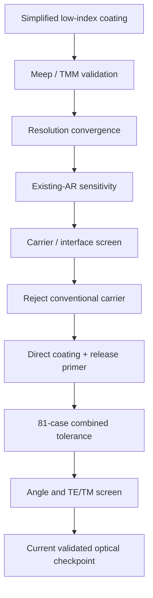
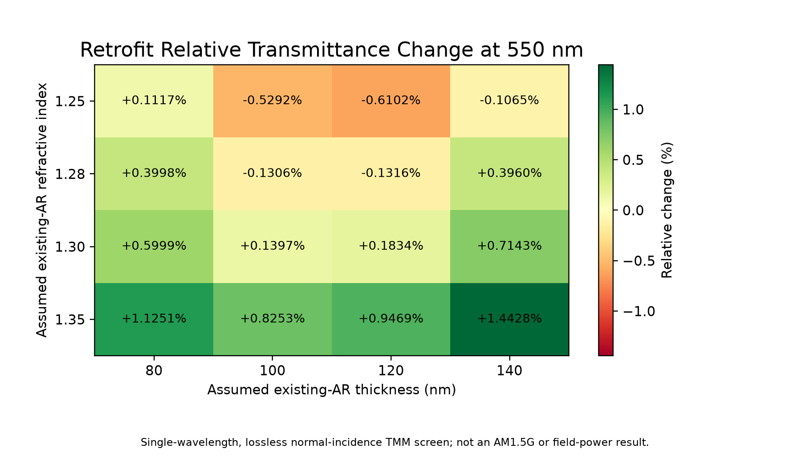
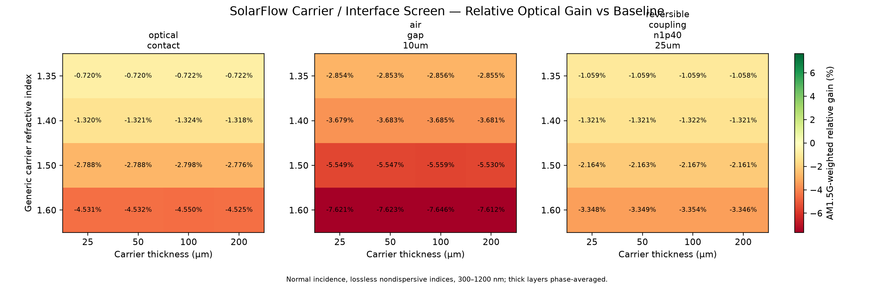
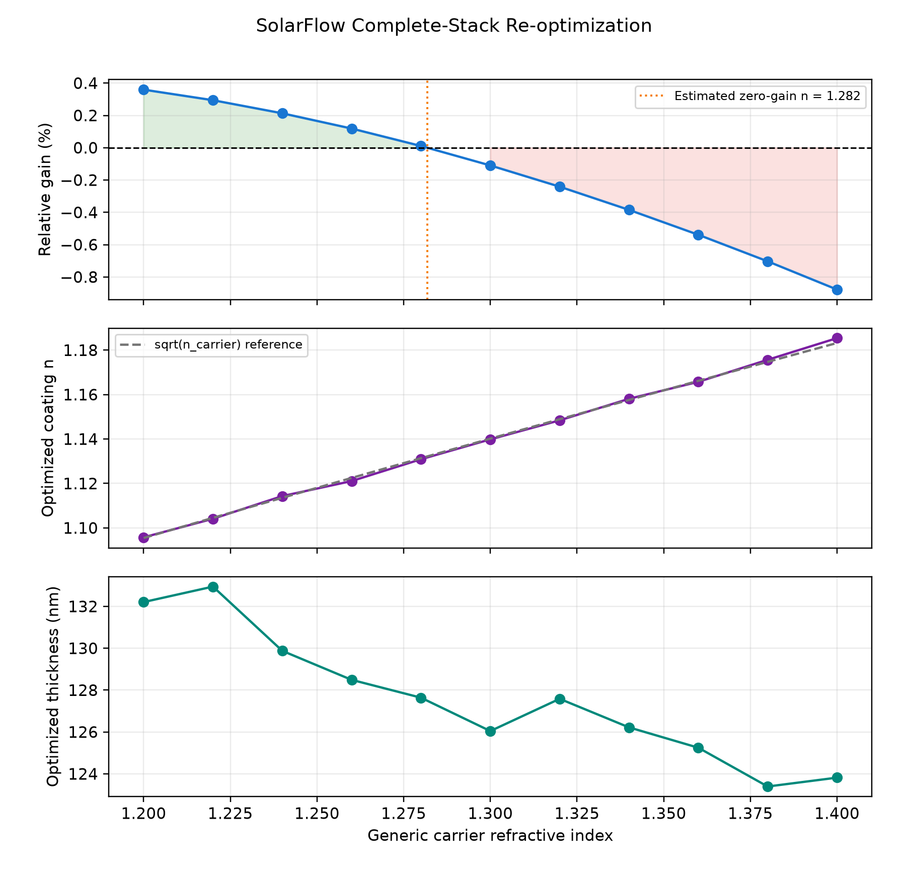
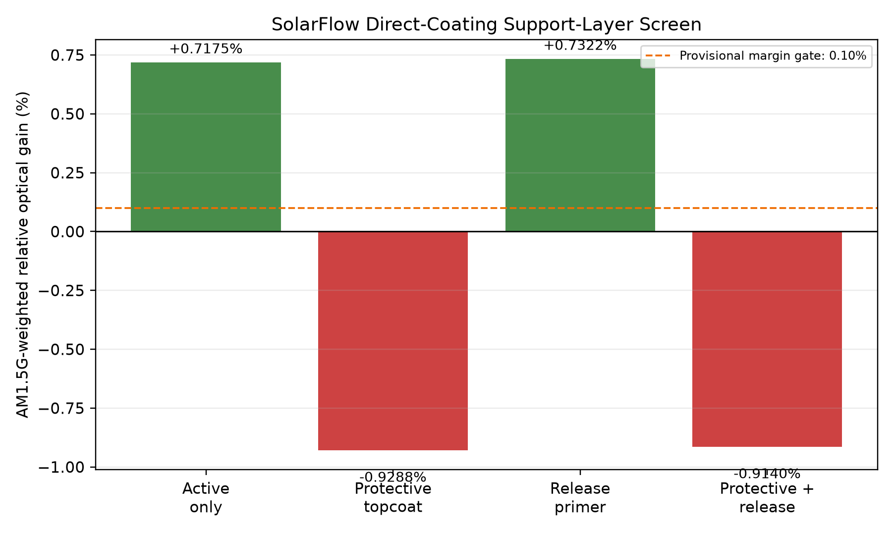
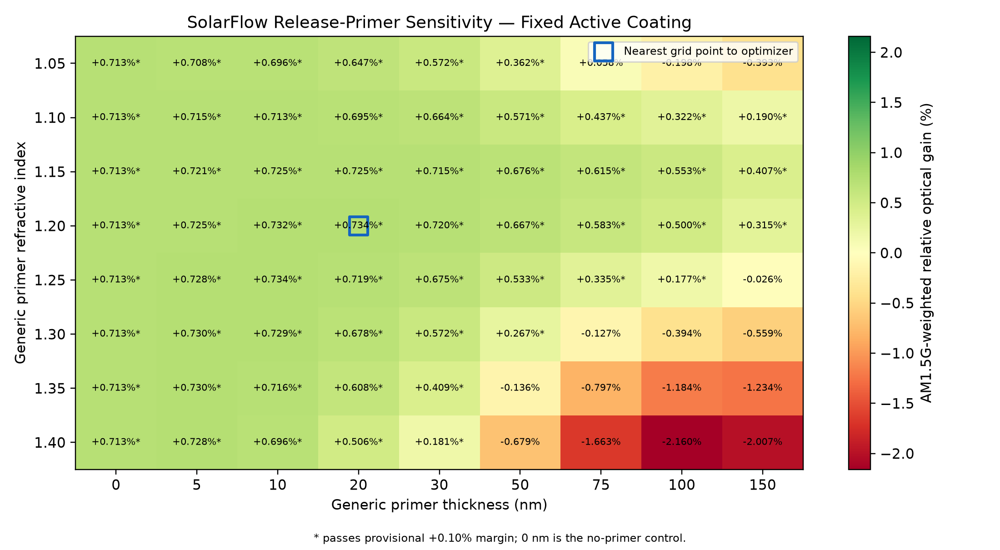
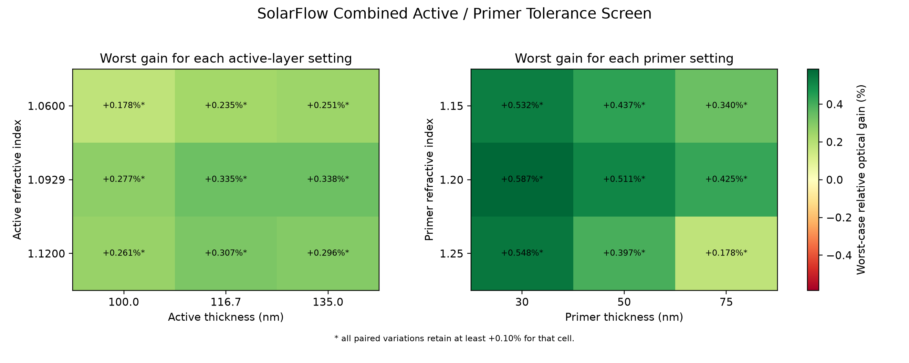
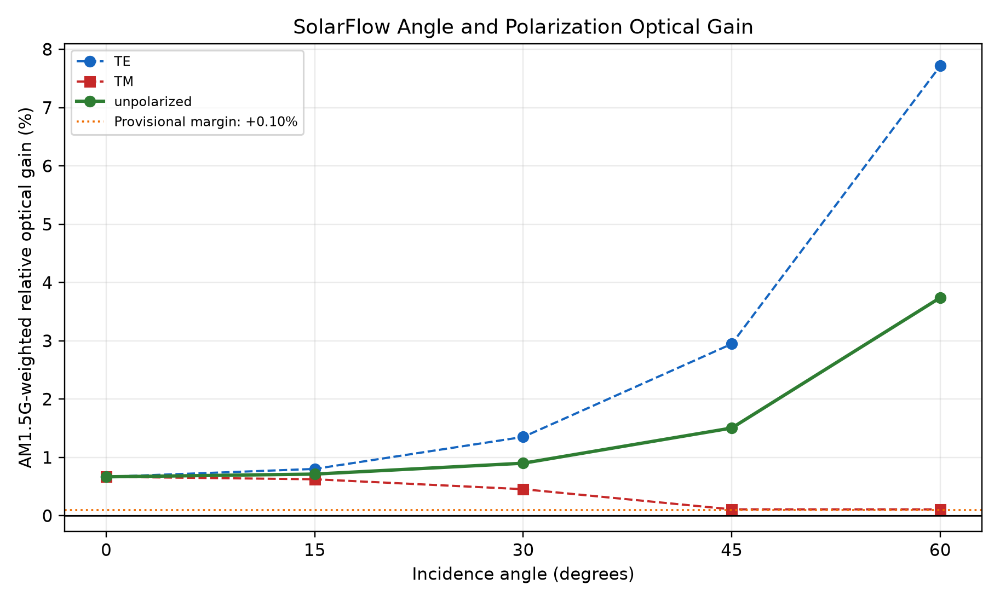
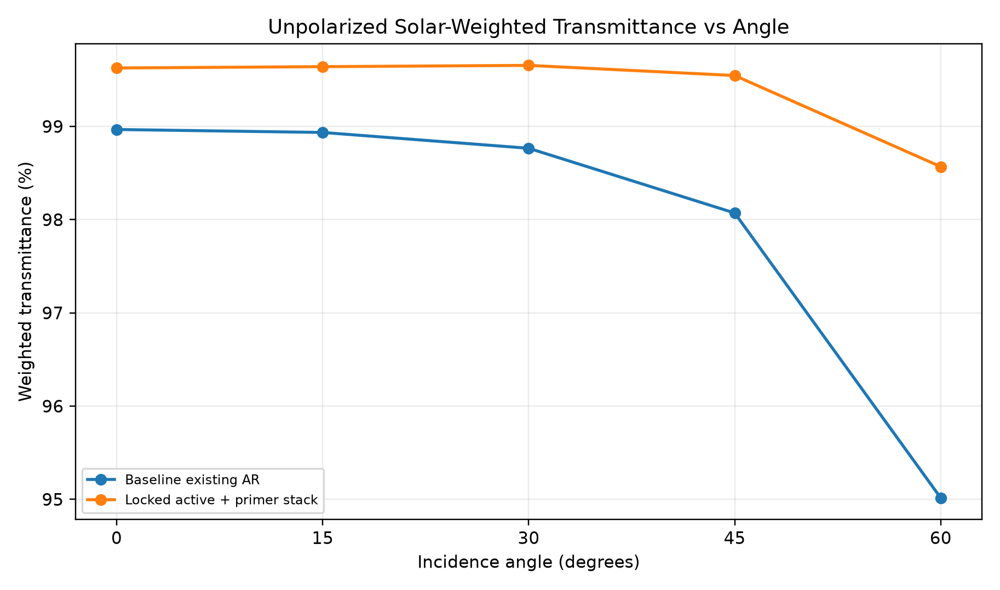

# SolarFlow AI — Validated Optical Simulation Results v1

**Competition track:** Circular Innovation  
**Reference application:** Sirindhorn floating solar  
**Reference module:** JA Solar JAM72D10-405/MB double-glass module  
**Report date:** 31 August 2026  
**Status:** Reproducible simulation checkpoint for team review

> This report documents modeled optical transmission. It does not demonstrate measured electrical output, annual energy yield, field durability, safe removability or a production-ready material.

## 1. Executive summary

SolarFlow AI investigates whether a service-renewable optical coating could improve the optical transmission of an existing photovoltaic module without replacing or adding another PV panel.

The work began with an ideal low-index coating and progressively added numerical validation, uncertainty and product constraints. A conventional carrier-film concept was rejected after complete-stack screening. The current primary concept is a direct renewable coating with a generic low-index release-primer layer.

The locked nominal optical stack is:

```text
Air
→ Active low-index coating: n = 1.092934, d = 116.736 nm
→ Generic release primer: n = 1.20, d = 50 nm
→ Assumed existing AR coating: n = 1.28, d = 100 nm
→ Cover glass: n = 1.52
```

The nominal active-plus-primer stack produced an AM1.5G-weighted relative optical gain of approximately `+0.6667%` at normal incidence. All `81/81` combined active/primer tolerance cases remained above the provisional `+0.10%` margin. The unpolarized gain also remained above the margin at all tested incidence angles from `0°` to `60°`.

These results support advancing the concept to material identification, electrical interpretation and independent experimental validation. They do not yet support a field-performance claim.

## 2. Research question and claim boundary

### Research question

Can a thin, renewable optical surface treatment increase modeled light transmission through the existing front optical stack of a PV module while avoiding replacement of the module itself?

### What is modeled

- Wavelength range: `300–1200 nm`
- Solar weighting: standard AM1.5G spectrum from Solcore
- Optical methods: transfer-matrix method (TMM) and Meep finite-difference time-domain (FDTD)
- Optimization: Optuna
- Baseline: air → assumed existing AR → cover glass
- Primary metric: relative change in transmitted optical power versus the baseline at the same incidence condition

### What is not yet modeled or demonstrated

- Measured electrical module power
- Real annual energy yield at Sirindhorn
- Measured optical constants of a selected coating or primer
- The exact factory AR stack on the selected JA Solar module revision
- Absorption, haze, roughness, soiling, water films or diffuse irradiance
- Coating application, removal, adhesion, cleaning or durability
- Module warranty, installation safety, cost or lifecycle impact

## 3. Simulation and decision workflow



| Stage | Main question | Outcome |
| --- | --- | --- |
| Simplified coating | Can an ideal added layer increase transmission? | Positive modeled result |
| Meep/TMM comparison | Do independent numerical methods agree? | Passed |
| Resolution convergence | Is the Meep result stable as resolution increases? | Passed at `200`, `250`, `300 pixels/µm` |
| Existing-AR sensitivity | Does the result depend on the unknown factory AR assumption? | Mixed; dependency documented |
| Carrier/interface screen | Can the nanometre coating be placed on a conventional carrier? | `0/48` positive cases; carrier concept rejected as primary |
| Carrier re-optimization | Can a very low-index carrier recover the result? | Only marginally below approximately `n=1.282` |
| Support-layer optimization | Can practical protection/removal layers retain gain? | Release-only passed; screened topcoat failed |
| Primer sensitivity | Is the release-primer result limited to a boundary point? | Broad low-index primer window identified |
| Combined tolerance | Does the locked stack survive simultaneous parameter variations? | `81/81` passed `+0.10%` margin |
| Angle/polarization | Does the result remain positive away from normal incidence? | Unpolarized result passed `0°–60°` |

## 4. Simplified coating validation

The validated simplified stack was:

```text
Air
→ Retrofit coating: n = 1.100474, d = 118.791 nm
→ Existing AR: n = 1.28, d = 100 nm
→ Cover glass: n = 1.52
```

At Meep resolution `300 pixels/µm`:

| Quantity | Result |
| --- | ---: |
| Incident optical power in modeled band | `836.0815 W/m²` |
| Existing-AR transmitted optical power | `827.4503 W/m²` |
| Retrofit transmitted optical power | `833.3811 W/m²` |
| Additional transmitted optical power | `+5.9336 W/m²` |
| Meep relative optical gain | `+0.717090%` |
| TMM relative optical gain | `+0.717433%` |
| Meep–TMM gain difference | `0.000343%` |

Meep/TMM agreement passed the defined validation gate. Resolution runs at `200`, `250` and `300 pixels/µm` passed individually, and the two highest resolutions passed the convergence criterion.

Related outputs:

- `product1/results/optimized_stack_meep_convergence.json`
- `product1/results/optimized_stack_meep_validation_r200.*`
- `product1/results/optimized_stack_meep_validation_r250.*`
- `product1/results/optimized_stack_meep_validation_r300.*`

## 5. Existing-AR uncertainty

The actual JA Solar factory AR composition and thickness were not available. A reproducible `550 nm` sensitivity screen was therefore performed across assumed existing-AR indices and thicknesses.

The screen reproduced the collaborating-team document to four decimals. It also demonstrated that the added coating is not universally beneficial for every unknown existing-AR stack. This uncertainty must remain visible in the final submission.



> The heatmap is a single-wavelength screening result, not AM1.5G power or electrical output.

## 6. Carrier-film concept rejection

The first product architecture placed the coating on a removable transparent carrier. The screen included:

- Carrier indices: `1.35`, `1.40`, `1.50`, `1.60`
- Carrier thicknesses: `25`, `50`, `100`, `200 µm`
- Interfaces: optical contact, controlled air gap and reversible coupling layer
- Total cases: `48`

| Quantity | Result |
| --- | ---: |
| Positive candidates | `0/48` |
| Best interface | Optical contact |
| Best carrier assumption | `n=1.35`, `50 µm` |
| Best transmitted optical power | `821.488 W/m²` |
| Additional power versus baseline | `−5.957 W/m²` |
| Relative optical change | `−0.7199%` |



The coating was then re-optimized for the complete carrier stack. The highest sampled carrier index with a positive result was `1.28`, with an optimized coating of approximately `n=1.13089`, `d=127.64 nm`. The gain was only `+0.0108%`, and the interpolated zero-gain carrier index was `1.2818`.

This narrow margin was considered insufficient for a practical carrier because absorption, haze, contamination, thickness variation and aging were not included. The conventional carrier-film architecture was therefore rejected as the primary design.



## 7. Direct coating and support-layer decision

The product direction changed to a direct service-renewable coating. Four generic optical stacks were optimized:

| Scenario | Relative optical gain | Provisional `+0.10%` gate |
| --- | ---: | --- |
| Active coating only | `+0.7175%` | Pass |
| Protective topcoat | `−0.9288%` | Fail |
| Release primer | `+0.7322%` | Pass, but optimizer initially selected lower search boundaries |
| Protective + release | `−0.9140%` | Fail |



The protective-topcoat result applies only to the screened generic index and thickness ranges. It does not prove that every possible protective chemistry will fail. It does show that a protection layer cannot be added without complete optical re-evaluation.

## 8. Release-primer operating window

The release-primer optimizer selected approximately `n=1.2014`, `d=20.03 nm`, close to both lower search bounds. A fixed-active sensitivity grid was therefore used to determine whether a nonzero primer window existed.

The nominal primer was moved to an interior screening point:

```text
Generic release primer: n = 1.20, d = 50 nm
```

Maximum primer thickness retaining at least `+0.10%` in the fixed-active grid:

| Generic primer index | Maximum passing thickness |
| ---: | ---: |
| `1.05` | `50 nm` |
| `1.10` | `150 nm` |
| `1.15` | `150 nm` |
| `1.20` | `150 nm` |
| `1.25` | `100 nm` |
| `1.30` | `50 nm` |
| `1.35` | `30 nm` |
| `1.40` | `30 nm` |



This confirms an optical operating window. It does not identify a material or demonstrate that the layer performs as a removable primer.

## 9. Combined active/primer tolerance

The locked nominal stack was tested without per-case re-optimization:

```text
Active coating: n = 1.092934, d = 116.736 nm
Release primer: n = 1.20, d = 50 nm
```

The `81` combinations covered:

- Active index: `1.06`, nominal, `1.12`
- Active thickness: `100 nm`, nominal, `135 nm`
- Primer index: `1.15`, `1.20`, `1.25`
- Primer thickness: `30`, `50`, `75 nm`

| Quantity | Result |
| --- | ---: |
| Nominal relative optical gain | `+0.6667%` |
| Worst-case relative optical gain | `+0.1778%` |
| Worst-case parameters | Active `n=1.06`, `100 nm`; primer `n=1.25`, `75 nm` |
| Cases passing `+0.10%` | `81/81` |
| Full tolerance box | Pass |



The tolerance box is discrete and deterministic. It is not a statistical manufacturing capability analysis.

## 10. Angle and polarization robustness

The locked nominal stack was evaluated at five incidence angles using TE, TM and their unpolarized average.

| Incidence angle | TE relative gain | TM relative gain | Unpolarized relative gain | Unpolarized gate |
| ---: | ---: | ---: | ---: | --- |
| `0°` | `+0.6667%` | `+0.6667%` | `+0.6667%` | Pass |
| `15°` | `+0.8022%` | `+0.6246%` | `+0.7133%` | Pass |
| `30°` | `+1.3508%` | `+0.4544%` | `+0.9002%` | Pass |
| `45°` | `+2.9464%` | `+0.1085%` | `+1.5038%` | Pass |
| `60°` | `+7.7144%` | `+0.1080%` | `+3.7394%` | Pass |

Validation checks:

- Minimum unpolarized gain: `+0.6667%` at `0°`
- All tested unpolarized angles positive: `True`
- All tested unpolarized angles pass `+0.10%`: `True`
- Normal-incidence TE/TM match: `True`
- Energy-conservation gate: `True`





TM at `45°` and `60°` passes the provisional margin by only approximately `0.008 percentage points`. This narrow high-angle TM margin must be disclosed.

The large relative TE gain at high angle does not mean that total incident power increases. Projected irradiance decreases with `cos(θ)`. Relative gain compares the retrofit and baseline at the same angle.

## 11. Current product decision

### Primary concept

Advance a **service-renewable direct optical coating with a generic release-primer function**.

The proposed Circular value is that an optical surface function can be renewed without replacing the PV module. The release-primer concept is intended to support controlled renewal or removal, but that function remains an engineering hypothesis.

### Deprioritized concepts

- Conventional transparent carrier film
- Rigid secondary cover plate
- Screened protective topcoat

### Research options

- Ultra-low-index carrier below approximately `n=1.282`
- Protection achieved through the active coating chemistry rather than a separate topcoat
- Alternative ultrathin protective layers outside the screened range

## 12. Approved communication language

### Recommended

> Under the assumed optical stack, SolarFlow's locked active-coating and generic release-primer concept increased AM1.5G-weighted transmitted optical power by approximately 0.67% at normal incidence. The result remained positive across 81 combined tolerance cases and unpolarized incidence angles from 0° to 60°. These are optical simulation results and are not measured electrical or annual-energy gains.

### Avoid

- “SolarFlow increases electricity by 0.67%.”
- “The primer is proven to be removable.”
- “The coating is ready to install at Sirindhorn Dam.”
- “The material is proven to survive outdoor conditions.”
- “The result applies to every JA Solar module.”
- “AI discovered a production-ready coating.”

## 13. Reproducibility

Activate the verified environment:

```bash
conda activate solarflow-full
```

Main pipeline commands:

```bash
python product1/meep/baseline_glass.py
python product1/meep/flat_film.py
python product1/solcore/solar_weighted_optics.py
python product1/analysis/stacked_retrofit_tmm.py
python -m product1.optimizer.optimize_flat_retrofit
python -m product1.meep.validate_optimized_stack
python product1/analysis/ar_sensitivity.py
python -m product1.analysis.carrier_interface_screen
python -m product1.optimizer.optimize_complete_stack
python -m product1.optimizer.optimize_direct_coating_layers
python -m product1.analysis.release_primer_sensitivity
python -m product1.analysis.combined_active_primer_tolerance
python -m product1.analysis.angle_polarization_screen
```

The warning below may appear when importing Solcore:

```text
WARNING: The RCWA solver will not be available because an S4 installation has not been found.
```

The documented workflow uses custom TMM, Solcore AM1.5G data and Meep FDTD. It does not require RCWA/S4, so this warning does not invalidate the reported results.

## 14. Inputs required from the collaborating team

Before the simulation scope is expanded, request:

1. Confirmation that the direct renewable-coating service model fits the intended product story.
2. Exact JA Solar module datasheet revision and any available front-glass/AR information.
3. Candidate release-primer material or at least measured/claimed refractive index, absorption and feasible thickness.
4. Proposed protection mechanism if a separate topcoat is not used.
5. Module tilt, azimuth and operational layout for the intended Sirindhorn reference case.
6. Expected cleaning, humidity, water exposure and maintenance conditions.
7. Whether the submission requires an electrical-power estimate, annual-yield estimate or only validated optical evidence.
8. Any laboratory, university or industry partner available for witness-glass measurements.

## 15. Next technical gates

### Gate A — measured material inputs

Replace generic constant indices with wavelength-dependent complex optical constants, including absorption.

### Gate B — electrical interpretation

Pass the validated transmitted spectra to a traceable silicon-cell/module model. Report electrical results separately from optical transmission.

### Gate C — site-angle interpretation

Use actual array tilt, azimuth and irradiance distribution. Do not label the five-angle screen as annual yield.

### Gate D — independent validation

- Validate selected oblique cases using another implementation or solver.
- Measure spectral transmission and haze on coated witness glass when access becomes available.
- Test thickness, adhesion, release, abrasion, water, UV and thermal cycling.

## 16. Pause-point conclusion

The current simulation package has reached a defensible optical checkpoint:

- Meep/TMM agreement: passed
- Meep resolution convergence: passed
- Carrier-film feasibility: rejected for conventional index range
- Direct active/release-primer stack: selected
- Release-primer sensitivity window: identified
- Combined tolerance: `81/81` passed
- Unpolarized angle screen `0°–60°`: passed

The next work should be driven by collaborator input or measured material/site data rather than adding further idealized layers. Until those inputs arrive, the recommended action is to preserve this checkpoint, push the repository and avoid expanding the performance claim.
