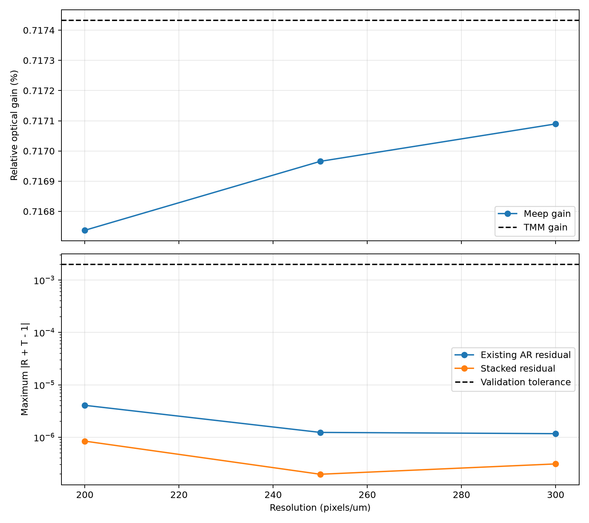
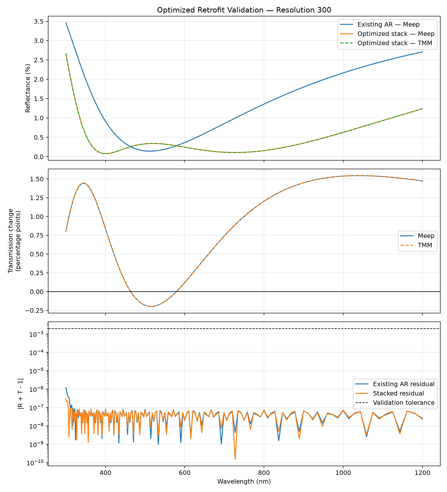

# SolarFlow AI — Simulation Validation Report

## Retrofit Optical Layer for Existing Solar Panels

**Version:** 1.0  
**Date:** 31 August 2026  
**Competition track:** Circular Innovation  
**Application context:** Existing floating photovoltaic systems  
**Example site:** Sirindhorn Dam floating solar farm  
**Validation status:** **PASSED**  

> This report supersedes the earlier preliminary Meep validation results dated
> 30 August 2026. In particular, the previous `passes_validation: false` result
> is obsolete after correcting the source bandwidth, termination condition,
> boundary configuration, and resolution-convergence workflow.

---

## 1. Executive Summary

SolarFlow AI investigates a removable optical retrofit layer that can be
installed above the cover glass of an existing photovoltaic module. The aim is
to reduce front-surface optical reflection and increase the amount of sunlight
transmitted toward the solar cells without purchasing additional PV modules.

The current study optimized and validated a planar low-index retrofit layer on
top of a representative existing anti-reflection coating. The selected
candidate has:

| Parameter | Optimized value |
|---|---:|
| Effective refractive index | 1.100474 |
| Thickness | 118.791 nm |

At the highest tested Meep resolution of 300 pixels/µm, the candidate increased
AM1.5G-weighted transmitted optical power from **827.450 W/m²** to
**833.381 W/m²**. This is an increase of **5.934 W/m²**, equivalent to a
**0.7171% relative optical gain** over the representative existing-AR baseline.

Independent Meep FDTD and Transfer Matrix Method calculations agreed within
**0.000343 percentage points** in relative gain. Validation passed at
resolutions 200, 250, and 300 pixels/µm, and the gain difference between the two
highest resolutions was only **0.000124 percentage points**.

The result supports the optical feasibility of the concept under the stated
idealized assumptions. It is **not yet a measured or electrically validated
power increase** for a commercial JA Solar module.

---

## 2. Problem and Circular-Innovation Rationale

Existing solar farms already contain substantial embodied materials, mounting
systems, electrical infrastructure, and operational assets. Replacing usable
modules solely to obtain a small efficiency improvement would require new
material and capital inputs.

The proposed concept instead investigates a serviceable optical layer that may:

- improve utilization of an existing PV asset;
- delay or reduce pressure for premature module replacement;
- be installed without adding another complete PV module;
- be removed, replaced, repaired, or recovered independently of the module;
- support a modular product-service or maintenance model.

The circular benefit remains a design hypothesis. It must later be evaluated
against material use, service life, recyclability, installation impacts, and
the actual energy gained over the retrofit lifetime.

---

## 3. Research Question

Can a transparent optical layer installed above an existing solar-panel
anti-reflection coating increase solar-weighted optical transmission without
replacing the original module?

The present phase addresses four narrower questions:

1. Can a candidate layer be found by automated parameter optimization?
2. Does the gain remain when the candidate is stacked on an existing AR layer?
3. Do independent TMM and Meep solvers produce consistent results?
4. Does the Meep result converge as numerical resolution increases?

---

## 4. Simulated Optical Structure

The simulated planar stack is:

```text
Incident sunlight
       ↓
Air
       ↓
Retrofit optical layer
       ↓
Representative existing anti-reflection coating
       ↓
Solar-panel cover glass
```

Two cases were compared:

| Case | Layer stack |
|---|---|
| Existing baseline | Air → Existing AR → Glass |
| Retrofit candidate | Air → Retrofit → Existing AR → Glass |

Representative baseline parameters:

| Parameter | Value |
|---|---:|
| Air refractive index | 1.00 |
| Existing AR refractive index | 1.28 |
| Existing AR thickness | 100 nm |
| Cover-glass refractive index | 1.52 |
| Wavelength range | 300–1200 nm |
| Angle of incidence | 0° |

The existing AR and glass values are model assumptions. They are not yet
confirmed specifications for a JA Solar 405 W Double-Glass module or the
modules installed at Sirindhorn Dam.

---

## 5. Role of AI and Numerical Tools

### 5.1 Automated Design Search

Optuna with a Tree-structured Parzen Estimator was used to explore candidate
refractive indices and thicknesses. Its role is an AI-assisted/model-based
parameter search. It does not replace the physical solvers.

### 5.2 Transfer Matrix Method

TMM provides a fast analytical/numerical solution for planar multilayer films.
It was used for optimization and as an independent reference for Meep.

### 5.3 Meep

Meep uses the finite-difference time-domain method to simulate electromagnetic
propagation, reflection, and transmission. Although the computational cell has
a thin transverse dimension, the layers are uniform in that direction, so this
experiment represents an effectively one-dimensional planar optical stack at
normal incidence.

### 5.4 Solcore

Solcore supplies the standard AM1.5G solar spectrum used to weight the optical
transmission over 300–1200 nm. A full electrical solar-cell model has not yet
been applied.

### 5.5 DEVSIM

DEVSIM was not used in this validation phase. It remains an optional tool for a
later semiconductor-device study if the required device parameters become
available.

---

## 6. Candidate Selection

An initial quarter-wave film designed for bare glass produced a negative result
when placed directly above the existing AR layer. This demonstrated that a film
optimized for bare glass cannot be assumed to work on an already-coated module.

The retrofit therefore had to be optimized as part of the complete stack.

| Search space | Best result |
|---|---:|
| Practical polymer-like range | 0.0392% relative optical gain |
| Engineered low-index range | 0.7174% TMM relative optical gain |

The engineered low-index result was selected for independent Meep validation:

| Candidate property | Value |
|---|---:|
| Effective refractive index | 1.100474 |
| Thickness | 118.791 nm |

The refractive index is a target effective optical property, not yet a selected
commercial material. Achieving a value close to 1.10 may require a porous,
graded-index, microstructured, or nanostructured layer.

---

## 7. Corrected Meep Validation Method

The final validation workflow corrected the main numerical weaknesses of the
preliminary run:

- the Gaussian source bandwidth was made 1.2 times wider than the monitor band;
- source cutoff was increased to improve broadband spectral quality;
- the simulation no longer stops at an arbitrary fixed time;
- each run continues until the electric field has decayed to the specified
  tolerance after the source ends;
- the PML thickness and free-space padding were increased;
- source coverage is checked across all 181 requested wavelength points;
- reference normalization and reflected-field subtraction are applied
  consistently;
- output files are separated by resolution to prevent accidental overwriting;
- resolution convergence is evaluated automatically.

Key settings:

| Setting | Value |
|---|---:|
| Spectral samples | 181 |
| Wavelength range | 300–1200 nm |
| Source bandwidth multiplier | 1.2 |
| Gaussian source cutoff | 8.0 |
| PML thickness | 1.5 µm |
| Cell length | 14.0 µm |
| Field-decay tolerance | 1 × 10⁻⁹ |
| Tested resolutions | 200, 250, 300 pixels/µm |
| Source coverage | 181/181 points |

---

## 8. Validation Criteria

The tolerances were defined before the final result and were not relaxed to
force a pass.

| Criterion | Required value |
|---|---:|
| Maximum Meep–TMM reflectance error | ≤ 2 × 10⁻³ |
| Maximum energy residual, `|R + T − 1|` | ≤ 2 × 10⁻³ |
| Maximum relative-gain difference | ≤ 0.1 percentage points |
| Maximum high-resolution gain spread | ≤ 0.05 percentage points |
| Source coverage | Full requested band |
| Finite spectral results | Required |

An individual run passes only when all applicable conditions are satisfied.
The convergence gate additionally requires the highest-resolution run to pass
and the gain spread between the two highest resolutions to remain within the
defined limit.

---

## 9. Resolution-Convergence Results

| Resolution (pixels/µm) | Meep relative gain | Maximum existing residual | Maximum stacked residual | Individual validation |
|---:|---:|---:|---:|:---:|
| 200 | 0.716737% | 4.059 × 10⁻⁶ | 8.413 × 10⁻⁷ | PASS |
| 250 | 0.716966% | 1.234 × 10⁻⁶ | 1.961 × 10⁻⁷ | PASS |
| 300 | 0.717090% | 1.168 × 10⁻⁶ | 3.088 × 10⁻⁷ | PASS |

High-resolution comparison:

| Metric | Result | Limit | Status |
|---|---:|---:|:---:|
| Gain spread, resolution 250 vs 300 | 0.000124 percentage points | 0.05 percentage points | PASS |
| Highest-resolution individual validation | Passed | Required | PASS |
| Overall convergence | Passed | Required | **PASS** |

The high-resolution gain spread is approximately 403 times smaller than the
allowed convergence limit. The gain therefore does not appear to be an artifact
of a single grid resolution.



---

## 10. Final Result at Resolution 300

### 10.1 Solar-Weighted Optical Performance

| Metric | Meep result |
|---|---:|
| Incident optical power in modeled band | 836.082 W/m² |
| Existing-AR transmitted optical power | 827.450 W/m² |
| Retrofit-stack transmitted optical power | 833.381 W/m² |
| Additional transmitted optical power | **5.934 W/m²** |
| Absolute optical gain | **0.7097 percentage points** |
| Relative optical gain vs existing AR | **0.7171%** |

The absolute optical gain is calculated relative to incident optical power. The
relative optical gain is calculated relative to the transmitted power of the
existing-AR baseline. These values answer different questions and should not be
used interchangeably.

### 10.2 Independent-Solver Agreement

| Metric | Result |
|---|---:|
| Meep relative optical gain | 0.717090% |
| TMM relative optical gain | 0.717433% |
| Gain difference | **0.000343 percentage points** |
| Allowed gain difference | 0.1 percentage points |

### 10.3 Pointwise Numerical Checks

| Validation metric | Maximum value | Wavelength | Limit | Status |
|---|---:|---:|---:|:---:|
| Existing-AR Meep–TMM error | 1.044 × 10⁻⁴ | 300 nm | 2 × 10⁻³ | PASS |
| Retrofit-stack Meep–TMM error | 4.988 × 10⁻⁵ | 300 nm | 2 × 10⁻³ | PASS |
| Existing-AR energy residual | 1.168 × 10⁻⁶ | 300 nm | 2 × 10⁻³ | PASS |
| Retrofit-stack energy residual | 3.088 × 10⁻⁷ | 300 nm | 2 × 10⁻³ | PASS |

The maximum energy residual measured across the full modeled band is well below
the fixed tolerance. The final automated flag is:

```text
passes_validation: true
passes_convergence: true
```



---

## 11. Interpretation for a Nominal 405 W Module

A simple linear scaling provides a communication scenario:

```text
405 W × 0.7171% ≈ 2.90 W
```

This corresponds to a nominal value of approximately:

```text
405 W → 407.9 W per module
```

This value is an **optical-equivalent estimate only**. It assumes that the
relative increase in transmitted optical power converts linearly into maximum
electrical power, which has not yet been demonstrated. It must not be presented
as a measured module rating, guaranteed output, or validated field gain.

An electrical estimate requires at least a wavelength-dependent EQE or solar-cell
device model, the exact module specification, operating temperature, incidence
conditions, and system-level losses.

---

## 12. What Has Been Demonstrated

The current work demonstrates that:

1. The corrected numerical workflow is stable across the tested resolutions.
2. Independent Meep and TMM models predict almost the same optical gain.
3. The optimized planar candidate increases modeled AM1.5G-weighted optical
   transmission above the representative existing-AR baseline.
4. The gain remains after strict pointwise energy-conservation checks.
5. Automated optimization can screen retrofit parameters before laboratory
   fabrication.

The current work does **not** demonstrate that:

1. a commercial material with the exact optimized properties is available;
2. the layer survives installation or long-term floating-solar conditions;
3. the same gain occurs at non-normal solar incidence;
4. a JA Solar 405 W module has the assumed front optical stack;
5. electrical output increases by exactly 0.7171%;
6. the concept is economically or environmentally superior over its lifetime.

---

## 13. Current Limitations

1. The existing AR layer is representative, not manufacturer-confirmed.
2. Refractive indices are modeled as lossless and wavelength-independent.
3. The model uses a planar uniform layer without roughness or defects.
4. Only normal incidence at 0° has been validated.
5. Angle-dependent TE/TM polarization has not been evaluated.
6. Adhesive, carrier substrate, air gaps, and encapsulation are not included.
7. Absorption and scattering losses of a manufacturable material are absent.
8. Water, humidity, heat, UV exposure, soiling, and cleaning are not modeled.
9. Manufacturing tolerance and installation misalignment are not included.
10. Electrical conversion, temperature coefficients, mismatch, wiring, and
    inverter losses are outside the current model.
11. No laboratory coupon, module test, or field validation has been performed.
12. Circularity and lifecycle benefits have not yet been quantified.

---

## 14. Required JA Solar Baseline Data

Before claiming results for a specific JA Solar 405 W Double-Glass module, the
team should obtain the complete module code and manufacturer datasheet.

Minimum required information:

- full model/SKU, including suffix;
- rated Pmax, Vmp, Imp, Voc, and Isc at STC;
- module dimensions and active cell area;
- cell technology and number/layout of cells;
- front-glass thickness and type;
- information about front-surface AR treatment, if available;
- bifacial status and bifaciality rating;
- temperature coefficients;
- spectral response or EQE, if available;
- installation tilt and orientation for the target site.

If proprietary layer data cannot be obtained, the report must distinguish
manufacturer-provided values from documented assumptions and sensitivity
ranges.

---

## 15. Recommended Next Phase

### Priority 1 — Freeze and Communicate the Validated Result

- Preserve the validated scripts, JSON, CSV, and figures in Git.
- Keep the fixed tolerances and record the software environment.
- Use the exact values in this report for the current presentation.
- Label the 405 W calculation as an optical-equivalent scenario.

### Priority 2 — Build the JA Solar Module Baseline

- Identify the full 405 W Double-Glass model code.
- Extract electrical and physical parameters from the datasheet.
- Separate confirmed data from assumptions.
- Recalculate the scenario using module area and active area.

### Priority 3 — Map the Optical Target to Real Materials

- shortlist low-index porous or structured optical concepts;
- obtain wavelength-dependent refractive index and extinction data;
- include carrier and adhesive layers;
- impose realistic minimum thickness and manufacturing constraints;
- evaluate water and moisture sensitivity for floating PV use.

### Priority 4 — Operating-Condition Robustness

- sweep incidence angle, for example 0°, 15°, 30°, 45°, and 60°;
- evaluate TE and TM polarization;
- add thickness and refractive-index tolerance sweeps;
- evaluate whether the gain remains positive across realistic conditions.

### Priority 5 — Electrical and Circular Assessment

- pass the transmitted spectrum to a Solcore cell/device model;
- estimate changes in short-circuit current, efficiency, and maximum power;
- incorporate module temperature and system losses;
- compare added material, installation effort, lifetime energy, and end-of-life
  recovery with continued operation and module replacement alternatives.

---

## 16. Reproducibility

Validated environment:

| Software | Version |
|---|---:|
| Python | 3.11 |
| Meep | 1.34.0 |
| Solcore | 5.10.1 |
| Optuna | 4.9.0 |
| Platform | Ubuntu 24.04 on WSL2 |

Activate the environment:

```bash
conda activate solarflow-full
cd ~/projects/solarflow-ai/imported/solarflow_ai
```

Run the validated convergence study:

```bash
python -m product1.meep.validate_optimized_stack_v2 \
  --resolutions 200 250 300
```

Principal result files:

```text
product1/results/optimized_stack_meep_validation_r200.csv
product1/results/optimized_stack_meep_validation_r200.json
product1/results/optimized_stack_meep_validation_r250.csv
product1/results/optimized_stack_meep_validation_r250.json
product1/results/optimized_stack_meep_validation_r300.csv
product1/results/optimized_stack_meep_validation_r300.json
product1/results/optimized_stack_meep_convergence.csv
product1/results/optimized_stack_meep_convergence.json
product1/results/figures/optimized_stack_meep_validation_r300.png
product1/results/figures/optimized_stack_meep_convergence.png
```

---

## 17. Final Conclusion

The numerical validation phase is complete for the current idealized optical
model. The optimized retrofit layer produced a repeatable, converged relative
optical gain of approximately **0.717%**, corresponding to an additional
**5.93 W/m²** of AM1.5G-weighted transmitted optical power over the representative
existing-AR baseline.

The result passed independent-solver agreement, energy-conservation, full-band
source-coverage, and resolution-convergence criteria without relaxing the
predefined tolerances.

The next decision is no longer whether the current numerical result is stable.
The next decision is whether a durable, removable, low-index structure can be
manufactured and whether its optical benefit remains meaningful after using the
actual module specification, operating angles, electrical conversion, cost,
and circular-lifecycle constraints.

---

## 18. References

- Meep source code: https://github.com/NanoComp/meep
- Meep documentation: https://meep.readthedocs.io/
- Solcore source code: https://github.com/qpv-research-group/solcore5
- Solcore documentation: https://docs.solcore.solar/
- DEVSIM source code: https://github.com/devsim/devsim
- Optuna: https://optuna.org/
- Project context: `docs/egat_context.md`

